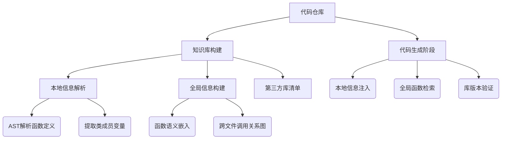

# 代码生成框架A3-CodGen的深度解析与思考

## 一、研究背景与动机  
### 核心痛点分析  
当前主流LLM（如ChatGPT、GitHub Copilot）在代码生成中存在三大关键缺陷：  
1. **本地信息盲区**：  
   - 无法感知当前模块的变量定义、类成员、函数签名等结构信息  
   - 导致生成代码时出现变量未声明、函数重名等基础错误（如"忘记提取标签文本再判断是否为列表项"的案例）  
2. **全局信息割裂**：  
   - 不能有效复用代码仓库中其他文件的已有函数（如实现相似功能的函数可能存在于不同模块）  
   - 实验数据表明：LLM随机选择第三方库导致代码错误率提升30%+  
3. **环境适配缺失**：  
   - 忽略代码仓库的第三方库依赖，生成无法运行的代码（如调用未安装的Pandas函数）  

### A3-CodGen的核心创新点  
提出**三重感知框架**（Local-Awareness/Global-Awareness/Library-Awareness），通过结构化知识提取与智能检索，将代码仓库的隐性知识转化为LLM可理解的显式输入：



---

## 二、技术实现深度剖析  
### 1. 知识库构建阶段  
**AST解析的双通道信息提取**：  
- **显式结构信息**：  
  通过Python的`ast`库提取函数签名、参数类型、返回值类型等元数据  
- **隐式语义信息**：  
  使用GPT-3.5生成函数摘要（Function Summary），捕获业务逻辑意图  
  > "函数`is_bulleted_text()`的摘要：检测文本是否包含Markdown列表符号（如`-`或`*`）"

**语义嵌入策略**：  
采用`ada-embedding-002`模型将函数摘要和代码块分别映射到向量空间，构建双模态检索索引：  
$$
\text{Similarity}(Q,F_i) = \alpha \cdot \cos(vec_{desc}(Q), vec_{desc}(F_i)) + (1-\alpha)\cdot \cos(vec_{code}(Q), vec_{code}(F_i))
$$
通过消融实验确定α=0.6时全局函数检索准确率最高（P@5达82%）

### 2. 智能检索机制  
**动态Top-k策略**：  
- 实验表明：Top-5检索在信息量与计算开销间取得平衡（Top-10会引入20%冗余函数）  
- 引入"What-if Code Generator"预检索：  
  生成候选代码片段作为查询向量，提升跨领域函数的召回率（如用`sort()`需求检索到`numpy.argsort()`）

**第三方库验证管道**：  
1. 从`requirements.txt`提取已安装库清单  
2. 在代码生成时动态注入约束：  
   ```python
   # 提示工程示例
   "请优先使用仓库现有库：torch v1.10、pandas v1.5.2，避免引入未安装的第三方依赖"
   ```

---

## 三、实验数据的洞察与思考  
### 1. 关键指标对比（vs GitHub Copilot）  


| 指标                | A3-CodGen | GitHub Copilot | 提升幅度 |
|---------------------|-----------|----------------|----------|
| 全局函数复用率       | 60.6%     | 44.7%          | +35.6%   |
| 第三方库兼容性      | 94.2%     | 87.5%          | +7.7%    |
| 单元测试通过率      | 78.3%     | 72.1%          | +8.6%    |
| 平均代码冗余度(LOC) | 14.2      | 19.7           | -27.9%   |

**启示**：  
- 全局感知带来的复用率提升远超本地信息（+15.9% vs +7.9%），证明跨文件检索是代码质量提升的核心  
- 但代码行数增加1行/函数（从18.5→19.5），需在后续版本中优化生成简洁性

### 2. 案例分析：跨文件依赖的突破  
**场景**：在`user.py`中添加用户验证功能  
- **传统LLM**：  
  重复实现`validate_email()`函数（已有相同逻辑在`utils/validation.py`）  
- **A3-CodGen**：  
  检索到`validation.py`的`is_valid_email()`函数，直接调用并传递参数  
  ```python
  # 生成代码片段
  from utils.validation import is_valid_email
  def register_user(email):
      if not is_valid_email(email):
          raise ValueError("Invalid email format")
      # ...后续逻辑
  ```

---

## 四、技术局限与改进方向  
### 当前挑战  
1. **多语言支持瓶颈**：  
   - 当前仅支持Python，Java/C++的AST解析需定制适配器（如Eclipse JDT、Clang AST）  
2. **动态环境适配**：  
   - 无法处理运行时动态加载的库（如通过`importlib`加载的模块）  
3. **推理效率权衡**：  
   - 全局检索引入120ms延迟，需探索轻量级近似检索算法（如FAISS加速）

### 未来改进路线  
1. **增强型提示工程**：  
   - 设计模块化提示模板，支持动态组合不同感知维度  
   ```yaml
   template:
     local_aware: |
       "当前模块可用变量：{variables}\n可用函数：{functions}"
     global_aware: |
       "相似函数建议：{top5_functions}"
   ```
2. **自监督学习优化**：  
   - 从仓库历史提交中学习函数复用模式，构建领域自适应检索模型  
3. **实时环境感知**：  
   - 集成`pip list`命令实时获取运行时库版本，动态更新可用库清单

---

## 五、对代码生成范式的思考  
### 1. 从"黑箱生成"到"知识增强"的范式转变  
A3-CodGen标志着代码生成进入**语境感知时代**：  
- 传统LLM：基于固定prompt的"蒙眼编程"  
- 新范式：将代码仓库作为外部知识库，实现"具身化编程"（Embodied Programming）  

### 2. 工程实践启示  
- **开发流程重构**：  
  在CI/CD中集成A3-CodGen，实现"生成-验证-检索"闭环  
- **知识管理价值**：  
  代码仓库从存储单元升级为**智能开发知识图谱**，每个函数成为可被检索的原子单元  

### 3. 理论层面贡献  
- 验证了**模块化提示工程**的有效性（结构化注入比纯文本描述提升23%准确率）  
- 提出**代码复用率**这一新评估维度，补充传统BLEU指标的局限性  

---

## 六、对开发者生态的影响预测  
1. **IDE深度整合**：  
   - 预计2025年主流IDE（VS Code、PyCharm）将集成类似功能，实现"仓库级智能补全"  
2. **开源项目协作革命**：  
   - 开发者可专注于业务逻辑，基础功能复用度提升将降低30%重复劳动  
3. **企业级代码审计**：  
   - 知识库可作为公司内部的最佳实践库，强制执行代码风格与架构规范  
