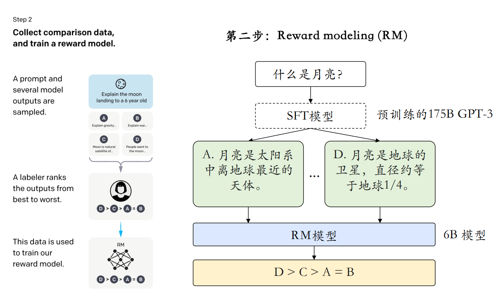
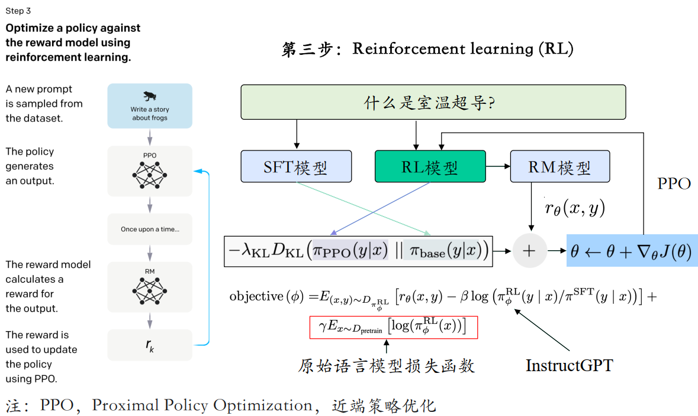
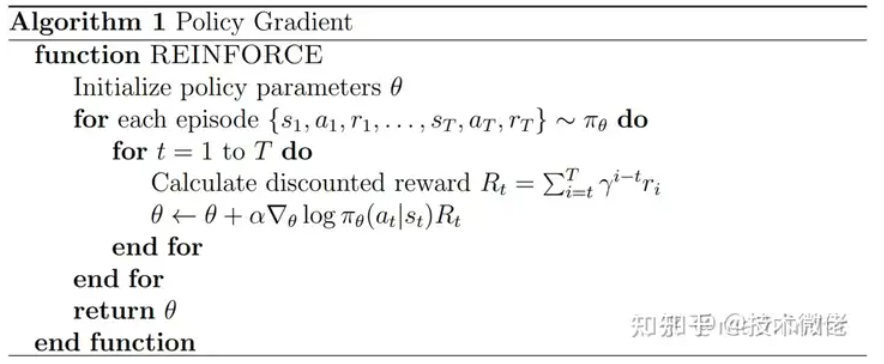
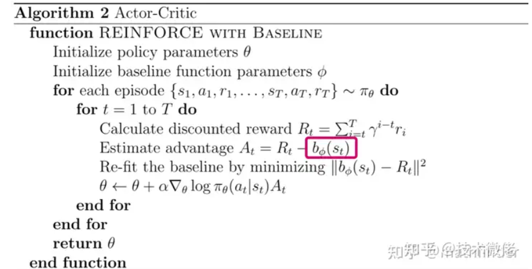

# SFT RLHF DPO
大模型训练三步走，pre-training、SFT、RLHF。

## 1 LLM的SFT
[参考资料](https://zhuanlan.zhihu.com/p/711825077)

微调是一种有监督的技术手段，是在已具备广泛知识基础的大型预训练语言模型上（基座LLM），利用**针对性的数据集**实施额外的训练过程，旨在使模型更精准地契合特定任务需求或**深入某一专业领域**。微调的核心目标在于实现知识的精细化灌输与指令系统的精确匹配，所以SFT的重点是学习样式和指令，而非知识注入。

### 1.1 全参数微调
SFT的数据一般在2k-10k之间；SFT的数据在准确，不在量大。另外，对于一般的人类阅读和生成能力，仅在1000个样本上就可以有不错的效果，但是对于**数学推理、代码生成**等复杂任务，需要较大的数据量

#### 1.1.1 避免灾难性遗忘
- 多任务微调：希望模型保持多任务泛化能力，可以一次性对多个任务执行微调
- 数据配比：在SFT数据中，增加一些通用生成的数据
- PEFT：保留了原始LLM的权重，训练少量特定于任务的适配器层和参数

#### 1.1.2 微调数据构建
- 样本多样性（Sample Diversity）
- 答案质量（Answer Quality）
- 一致性（Consistency）
- 难度适配（Difficulty Calibration）
- 噪声控制（Noise Reduction）

#### 1.1.3 基座模型选择 Chat or Base
- （1）**Base模型**是基于海量语料库进行的无监督学习，主要用于文本分类、情感分析、摘要生成等。这些任务主要关注文本内容的理解和处理，而不需要对特定指令做出响应。Base模型预训练之后没有做任何调整。它提供了基本的语言理解和生成能力，但可能需要针对特定任务进行微调或优化
- （2）**Chat模型**则是在指令微调的有监督学习下进行训练的。这意味着它使用人工标注的数据集进行训练，以便更好地理解和响应特定指令，主要用于指令学习任务，如问答系统、对话生成、智能客服等。在这些任务中，模型需要理解和响应人类的指令，以提供准确和有用的信息，是在Base模型上进行微调的版本，它通过指令微调和人工反馈强化学习等方法，使模型更加符合人类的价值观和指令要求

#### 1.1.4 SFT多优化项问题

#### 1.1.5 全参数微调技巧
- 模式一：基于base模型+领域任务的SFT；
- 模式二：基于base模型+领域数据 continue pre-train +领域任务SFT；
- 模式三：基于base模型+领域数据 continue pre-train +通用任务SFT+领域任务SFT；
- 模式四：基于base模型+领域数据 continue pre-train +通用任务与领域任务混合SFT；
- 模式五：基于base模型+领域数据 continue pre-train（混入SFT数据） +通用任务与领域任务混合SFT；
- 模式六：基于chat模型+领域任务SFT；
- 模式七：基于chat模型+领域数据 continue pre-train +领域任务SFT；

###  1.2 部分参数微调（Sparse Fine Tuning / Selective Fine Tuning Parameter-Efficient Fine-Tuning）
仅选择性更新模型中的某些权重，尤其是需要保留大部分预训练知识的情况下，包括：
- prefix/prompt-tuning
- P-tuning
- P-tuning v2
- Adapter-Tuning:较小的神经网络层或模块插入预训练模型的每一层
- LoRA:向模型权重矩阵添加低秩矩阵
- AdaLoRA:根据重要性评分动态分配参数预算给权重矩阵
- QLoRA:量化为 4 bit，添加一小组可学习的低秩适配器权重
- Freeze
- [其他](https://zhuanlan.zhihu.com/p/635152813)

###  1.3 小结
从理论分析上来看，SFT会修改大模型全量参数，可以在数据量充足的情况下学习更多的内容，效果上限应该更高，但也存在灾难性遗忘等不稳定情况。PEFT不管是prompt training还是LORA都是只修改少量参数，所以他的优点就是需要资源少，稳定性高，但是存在效果上限问题，有些场景下效果不好，特别是基座大模型在该领域任务上的效果本身就不好，很难通过PEFT来提升。

[补充](https://zhuanlan.zhihu.com/p/692892489)

## 2 LLM的RLHF
[理论参考](https://zhuanlan.zhihu.com/p/713049478)

[代码参考](https://zhuanlan.zhihu.com/p/714916268)

### 2.1 强化学习基础

- Agent
- environment
- State
- Action
- Reward
- Cumulative Reward

### 2.1.1 Reward model

RLHF的Reward是通过一个**Reward model模型生成**，Reward model最好和agent的model能力相似，能对agent的结果进行打分(**判别式排序**)。模型太大可能面临资源消耗过大，训练不稳定等,Reward model一般也是一个**参数量较小**的transformer模型（instructGPT的Reward_model：GPT-3-6B，deepspeed中的OPT-13B的Reward_model：OPT-350M）

训练：在一个batch里面，把每个Prompt对应的所有的模型输出，都过一遍Reward model，并把所有两两组合都比较一遍。比如一个Prompt有$K$个模型输出，那么模型则只需要处理$K$个样本就可以一气儿做$C_2^k$次比较。损失函数为：

$$Loss(\theta)=-\frac{1}{2}E_{(x,y_w,y_l)\sim D}[log(\sigma(r_\theta(x,y_w)-r_\theta(x,y_l)))]$$

其中，$x$是prompt，$y_w$和$y_l$分别是较好和较差的模型response，$r_\theta(x,y)$是Reward Model的输出，$\sigma$ 是sigmod函数$^{+}$，训练奖励模型实际上就是最大化 $P(y_w>y_l|x)$由于 r ( x , y ) r(x,y)r(x,y) 可能是负数，因此在使用Bradley-Terry建模时，需要预先过一下softmax。

### 2.1.2 PPO算法
PG算法的核心是用“Reward”作为权重，**最大化策略网络所做出的动作的概率**。

用策略网络$\pi_\theta$**采样出一个轨迹**，然后根据即刻得到的reward $r_t$计算discounted reward$R_t= \sum _{i= t}^T\gamma ^{i- t}r_i$ (未来奖励);用$R_t$作为权重，最大化这个轨迹下所采取的动作的概率$log(\pi(\overline{a_t}|s_t))\cdot R_t$ ,用梯度上升优化之。

由于**采样的稀疏性**，我们引入Actor-Critic算法

Actor指的是策略网络$\pi_\theta$; Critic网络 $b_\phi$ 目的就是给定一个$\pi_\theta$，预估每个状态 $s_t$ ,$\pi_\theta$奖励 $b_\phi(s_t)$是多少。Critic网络的更新通过优势函数（Advantage Function）来更新 (即：Critic 通过计算实际获得的奖励与预测价值的差异(通常使用 TD 误差)来更新其价值函数)。
Critic网络会生成一个期望奖励，只有真实获得的reward比期望奖励好，动作才会被优化，否则抑制它
- Advantage Function通过平衡偏差和方差来提高策略梯度方法的稳定性和效率：$A_t^\lambda=\sum_{k=0}^\infty(\gamma\lambda)^k\delta_t^{(k)}$
  $\cdot$ $\delta_t=r_t+\gamma V_{s_{t+1}}-V_{s_t}$是时刻$t$的优势估计
$\cdot$ $\gamma$ 是折扣因子$^{+}$
$\cdot$ $\lambda$ 是一个在[0,1] 范围内的平滑因子$^{+}$,控制偏差和方差的权衡。
$\cdot$ $V_{s_t}$是状态 st 的估计值。
### 2.1.3 PPO修正
AC算法存在稳定性问题，特别是深度模型。为了优化这一点PPO算法的做法包括两种，一种是：用拉格朗日乘数法直接将 KL 散度的限制放进了目标函数中，这就变成了一个无约束的优化问题，在迭代的过程中不断更新 KL 散度前的系数：
$$\arg\max\mathbb{E}_{s\sim\nu^{\pi_{\theta_k}}}\mathbb{E}_{a\sim\pi_{\theta_k}(\cdot|s)}\left[\frac{\pi_\theta(a|s)}{\pi_{\theta_k}(a|s)}A^{\pi_{\theta_k}}(s,a)-\beta D_{KL}[\pi_{\theta_k}(\cdot|s),\pi_\theta(\cdot|s)]\right]$$

另一种做法比较简单直接，在目标函数中进行限制，以保证新的参数和旧的参数的差距不会太大：
$$\arg\max_{\theta}\mathbb{E}_{s\sim\nu}\mathbb{E}_{\theta_{k}}\mathbb{E}_{a\sim\pi_{\theta_{k}}(\cdot|s)}\left[\min\left(\frac{\pi_{\theta}(a|s)}{\pi_{\theta_{k}}(a|s)}A^{\pi_{\theta_{k}}}(s,a),\mathrm{clip}\left(\frac{\pi_{\theta}(a|s)}{\pi_{\theta_{k}}(a|s)},1-\epsilon,1+\epsilon\right)A^{\pi_{\theta_{k}}}(s,a)\right)\right]$$

### 2.1.3 RLHF的PPO
LLM PPO需要三个模型网络：**RM、actor_model(SFT后的LLM)、critic_model**引入了一个网络来控制一下actor_model让它更新不要太偏离原本的SFT后的LLM，所以通过KL散度（作用是控制两个分布之间的差异），损失变为：
$$loss=\max_{\pi_\theta}\left\{\mathbb{E}_{x\sim\mathcal{D},y\sim\pi_\theta(y|x)}[r_\phi(x,y)]-\lambda\mathbb{D}_{\mathrm{KL}}[\pi_\theta(y|x)||\pi_{\mathrm{ref}}(y|x)]\right\}$$

至此RLHF中的四个网络就都出现了，分别是：

- （1）**Actor model** SFT后的LLM，需要训练的LLM，参数可变；
- （2）**Ref model** SFT后的LLM，用于限制actor model的KL散度，参数冻结；
- （3）**RM model** 奖励模型，用于强化学习的奖励提供，参数冻结；
- （4）**Critic model** 用于期望奖励生成，参数可变；

## 3 LLM的DPO
[参考1](https://zhuanlan.zhihu.com/p/714131454)

[参考2](https://blog.csdn.net/raelum/article/details/141612193)

[参考3](https://www.bilibili.com/video/BV1GF4m1L7Nt)

### 3.1 什么是DPO
**直接偏好优化**（Direct Preference Optimization, DPO）是一种不需要强化学习的对齐算法。由于去除了复杂的强化学习算法，DPO 可以通过与有监督微调（SFT）相似的复杂度实现模型对齐，不再需要在训练过程中针对大语言模型进行采样，同时超参数的选择更加容易。DPO是介于SFT和RLHF之间的，并不是完全的RLHF的替代，相当于RLHF的轻量版（模型数量少了一倍），DPO主要是去掉了Reward model，通过优化损失函数实现直接偏好策略控制。

### [3.2 DPO损失函数](https://zhuanlan.zhihu.com/p/671780768)
DPO模型由两个大模型组成，一是SFT后的LLM需要学习的模型；第二个和RLHF中一样需要一个ref模型，**防止模型跑偏**，结构也是SFT后的LLM，参数冻结
$$loss=\max_{\pi_\theta}\left\{\mathbb{E}_{(x,y_{\mathrm{win}},y_{\mathrm{lose}})\sim\mathcal{D}}[\log\sigma(\beta\log\frac{\pi_\theta(y_{\mathrm{win}}|x)}{\pi_{\mathrm{ref}}(y_{\mathrm{win}}|x)}-\beta\log\frac{\pi_\theta(y_{\mathrm{lose}}|x)}{\pi_{\mathrm{ref}}(y_{\mathrm{lose}}|x)})]\right\}$$
从loss公式上看，DPO算法的原理很简单，就是让模型在好结果上生成的概率尽量大于ref模型，在坏结果上生成的概率尽量低于ref模型，优点像对比学习（尽量靠近正例，远离负例）。从这个角度看DPO就是通过一种贪心的算法来优化LLM，缺少探索更优的路线（RLHF做的）
 
## 4 总结

