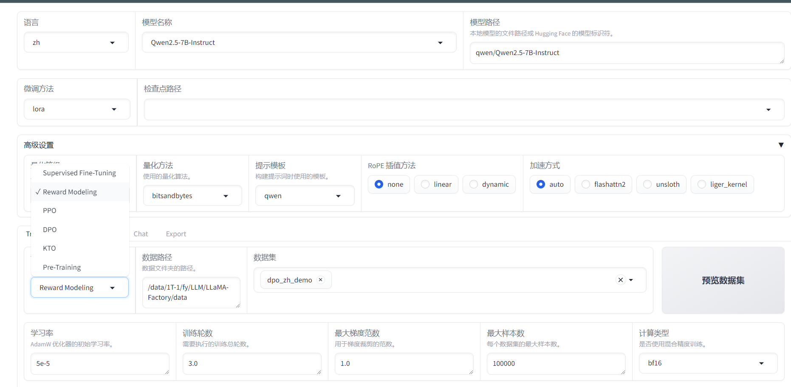

# TRL LLAMA-FACTORY UNSLOTH RAG

## Transformer Reinforcement Learning
[TRL参考资料](https://github.com/huggingface/trl)

目前(2024.10.11)llamafactory 0.9.1与trl 0.11.2冲突

## LLaMA-Factory
[LLaMA-Factory参考资料](https://github.com/hiyouga/LLaMA-Factory)
[GIT参考资料](https://github.com/InternLM/Tutorial/tree/camp3/docs/L0/Git)
目前(2024.10.11)llamafactory 0.9.1与trl 0.11.2冲突
打开的UI界面如下

## RAG
如让大模型快速或者在线插入新数据或者私域（公司数据）数据，
可以通过外挂数据库，通过搜索增强（RAG）技术，即优先让大模型利用你提供的文档来回答问题，
但是这只是让大模型用到这是数据，大模型内部并没有关于这方面的知识。

[RAG+QWEN2](https://www.youtube.com/watch?v=d9o2QU7gdu8)

## UNSLOTH

