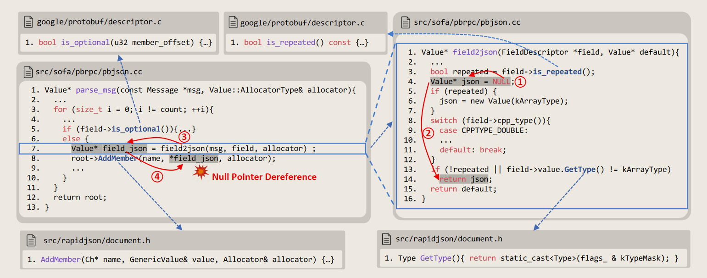

# REPOAUDIT: An Autonomous LLM-Agent for Repository-Level Code Auditing

## 动机
1. **代码审计的迫切需求与挑战**  
   - **代码库规模爆炸**：现代软件系统代码量指数级增长，人工审计难以应对（如大型开源项目或企业级代码库）。
   - **漏洞的复杂性**：许多关键漏洞（如空指针解引用、内存泄漏）需要**全局路径敏感分析**，而传统工具（如AST扫描器）仅支持局部推理。
   - **LLM的局限性**：
     - **上下文限制**：无法处理大规模代码库的完整上下文。
     - **幻觉问题**：可能生成逻辑不一致的路径条件或错误的数据流事实（如错误推断指针指向）。
     - **路径爆炸**：传统符号执行工具需遍历所有路径，计算成本过高。

2. **现有工具的不足**  
   - **局部分析工具**（如AST扫描器）：仅能检测简单漏洞（如语法错误），无法处理跨函数、跨文件的路径敏感漏洞（如CWE-121、CWE-78）。
   - **LLM-HUMAN协作**：在人类-LLM协作开发阶段，软件系统通常不可执行，甚至不可编译 。
   - **传统符号执行工具**：依赖SMT求解器验证路径条件，但面临路径爆炸、复杂约束建模困难（如动态内存操作）。
   - **LLM直接应用**：缺乏对代码库结构的系统性建模，易生成误报（如忽略跨函数条件矛盾）；另外一个项目库的文件的AST或CFG是非常庞大的，远远超出实际上下文限制。

3. **LLM独特的强势点**
   > 在有限的范围内直觉地寻找处理代码
   - 代码抽象：给定一个属性、一组初始程序点和定义的范围（例如，函数），抽象识别与范围内的属性相关的陈述子集
   - 指针处理：人类可通过对程序语义的理解直观、准确地确定特定指针变量的点到事实， LLM类似
    > point-to-analysis
    > 确定指针可能指向哪一个内存对象
   - 可行路径探索：人类以及LLM依赖于抽象和直观的逻辑推理来评估可行性，这在有限范围内非常有效。而传统工具计算成本很高，而且容易失败，因为将程序路径转换为逻辑公式需要探索大量的程序路径并建模大量缺乏逻辑术语直接表示的程序行为，例如循环、数组索引、别名、指针算术和无界字符串操作。

> Needle in a Haystack 问题
> 形容在大量信息或复杂环境中寻找一个非常小但关键的目标或信息。在人工智能和自然语言处理（NLP）领域，这个术语常被用来评估模型是否能够从大量无关信息中准确识别并提取出关键信息。
> 针对**Needle in a Haystack**问题采用的是RAG技术，本文更加关注LLM对程序路径敏感性和理解能力
---

## 做法
### 核心设计：REPOAUDIT
通过**代理驱动的分治策略**与**LLM的路径敏感推理**，解决大规模代码库审计中的路径爆炸与复杂漏洞检测难题。

#### 1. 关键模块
##### (1) **Initiator（发起者）**
> 定制模式匹配器（Pattern Matchers）
>   - 功能：模式匹配器是一组规则或算法，用于在 AST 中识别特定的代码模式。在漏洞检测中，这些匹配器专门用于识别漏洞的源值（sources），即漏洞可能产生的位置。
> - 实现方式：通过遍历 AST，匹配特定的语法节点或代码结构。例如，检测是否存在未经验证的用户输入（常见的安全漏洞源）。例如，检测未经验证的用户输入的匹配器可能如下：
```python
   def detect_unvalidated_input(node):
       if node.type == "call_expression" and "scanf" in node.text:
           return True
       return False
```
- **功能**：  
  - 定义漏洞类型（如NPD、ML）的**源点（sources）** 和 **污点(sinks)** 规则。  
  - 使用**Tree-sitter库**构建模式匹配器，自动识别代码中的源点（如未初始化指针、内存分配函数）。
- **输入**：目标代码库、漏洞定义（如CWE类型）。
- **输出**：需分析的初始函数列表（源点所在位置）。

##### (2) **Explorer（探索者）**


- **功能**：  
  - **动态导航**：从源点出发，逐函数分析数据流传播路径$p$，利用LLM的抽象能力跳过无关代码（如非关键分支）。
  - **Agent Memory**：存储跨函数的数据流事实（如指针指向、变量传播路径），支持后续路径拼接。Agent Memory是函数$M$的函数：
$$\begin{aligned}&\mathcal{M}(\text{field2json,NULL@}s_4)\\&=\left\{\left(p_1,\{\mathrm{NULL@}s_4\hookrightarrow\mathrm{json@}s_4,\mathrm{json@}s_4\hookrightarrow\mathrm{json@}s_{14}\}\right),\right.\\&\left(p_2,\{\mathrm{NULL@}s_4\hookrightarrow\mathrm{json@}s_4\}\right),\\&\left(p_3,\{\mathrm{NULL@}s_4\hookrightarrow\mathrm{json@}s_4\}\right)\end{aligned}$$

  - **路径可行性验证**：通过LLM检查路径条件是否矛盾（如`x > 5 ∧ x < 3`），排除不可行路径。
- **关键技术**：
  - **程序抽象**：忽略与漏洞无关的代码（如日志语句），聚焦关键逻辑。
  - **指针分析**：利用LLM推断指针可能指向的内存对象（如返回值是否为`NULL`）。
  - **跨函数传播**：追踪指针通过参数传递、返回值或全局变量的传播路径。

##### (3) **Validator（验证者）**

采用基于解析的分析器来验证控制流顺序。只有符合控制流顺序的数据流事实才会存储在Agent Memory中。
- **功能**：  
  - **矛盾检测**：检查跨函数路径条件的逻辑一致性（如函数A的条件与函数B的条件是否冲突）。
  - **漏洞报告生成**：若路径可行且触达污点（如解引用`NULL`指针），则生成包含完整数据流路径的报告。
- **示例**：  
  - 在函数`parse_msg`中，若`field2json`的返回值可能为`NULL`，且后续被解引用（行8），则报告NPD漏洞。

#### 2. 技术细节
- **路径敏感分析**：  
  - 结合**数据流图（DDG）**与**控制流图（CFG）**，推断数据流事实与控制流条件的关联。
  - 支持最多**4层函数调用链**分析，平衡覆盖率与计算成本。
- **LLM的高效利用**：  
  - **动态提示词生成**：为每个函数定制提示词，明确分析目标（如“检查`field2json`的返回值是否可能为`NULL`”）。
  - **控制流约束**：仅保留符合控制流顺序的数据流事实（如禁止“先解引用，后赋值”的逻辑错误）。
- **代理内存机制**：  
  - **全局状态共享**：存储各函数的分析结果，支持跨函数路径拼接。
  - **去重与优化**：避免重复分析相同函数，减少计算开销。

---

## 要求详细
### 创新与局限性
- **创新点**：  
  - **需求驱动导航**：仅探索与漏洞相关的路径，避免路径爆炸。
  - **LLM与符号执行的结合**：利用LLM的抽象推理能力弥补传统工具的建模缺陷。
- **局限性**：  
  - **调用链深度限制**：最多支持4层函数调用，可能遗漏长链复杂漏洞。
  - **依赖LLM质量**：若LLM生成错误的数据流事实（如误判指针指向），可能导致漏报或误报。

### 实验结果
- **有效性验证**：  
  - 在真实代码库中检测到多类路径敏感漏洞（如NPD、ML），误报率显著低于传统工具。
  - 通过LLM的矛盾检测机制，过滤了80%以上的无效报告。
- **性能评估**：  
  - 分析时间与代码库规模呈线性关系，适合大型代码库的增量审计。

---

## 总结
REPOAUDIT通过**代理协同**与**LLM的路径敏感推理**，实现了高效、精准的代码审计，尤其适用于跨函数、跨文件的复杂漏洞检测。其核心价值在于：  
1. **动态导航与分治策略**：分函数分析，动态调整路径探索优先级。  
2. **跨函数数据流追踪**：结合LLM的抽象能力与代理内存，实现全局路径拼接。  
3. **矛盾检测与误报过滤**：通过LLM验证路径条件一致性，提升报告质量。  
该方法为自动化代码审计提供了新范式，尤其在处理路径敏感漏洞时表现显著优势。


## 疑问
1. 函数调用链怎么获取
   

### 额外参考文献
- pathsensitive bugs：Qingkai Shi, Xiao Xiao, Rongxin Wu, Jinguo Zhou, Gang Fan, and Charles Zhang. Pinpoint: fast and precise sparse value flow analysis for million lines of code. In Jeffrey S. Foster and Dan Grossman, editors, Proceedings of the 39th ACM SIGPLAN Conference on Programming Language Design and Implementation, PLDI 2018, Philadelphia, PA, USA, June 18-22, 2018, pages 693–706. ACM, 2018a. doi: 10.1145/3192366.3192418.
- data dependence graph：Jeanne Ferrante, Karl J Ottenstein, and Joe D Warren. The program dependence graph and its use in optimization. In International Symposium on Programming, pages 125132. Springer, 1984.
- points-to analysis：Yannis Smaragdakis, George Balatsouras, et al. Pointer analysis. Foundations and Trends® in Programming Languages, 2(1):1–69, 2015.