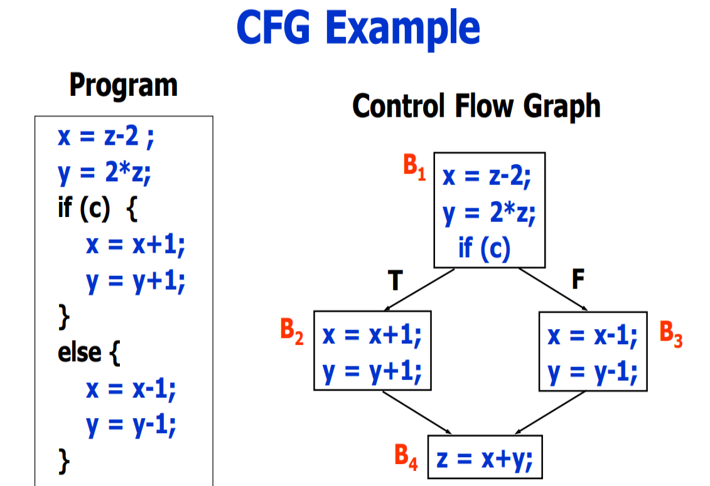
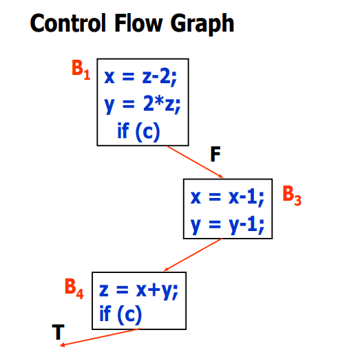
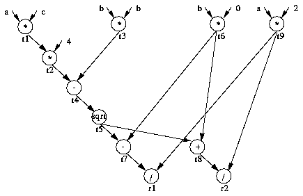

# Control Flow Graph (CFG)

## Overview
A **Control Flow Graph (CFG)** 是程序计算和控制流的图表示。用于建模程序的执行路径，是静态分析的核心。

## Structure of a CFG
The structure of a Control Flow Graph consists of two main components:
- **Nodes（computation）**: 令每个节点表示一个**basic block**. basic block 要么是一行代码或者几行可连续执行的代码，满足:
  - 单一的进入点（single entry point，no branching except at the beginning or end).
  - 在块中无跳转和分支(i.e., it is a linear sequence of instructions).
- **Edges（control flow）**: 表示块间可能的控制流:
  - 块尾到另一块首的边表明程序执行时潜在的转移路径
  - 块可能有多个入边和出边(e.g., loops, conditionals, or function calls).

## Basic block
连续语句序列，满足：
- 控制流只在序列首进入
- 控制流只在序列尾离开


## CFG Example:
可能的执行路径为图中的path
### Execution 1
B1->B2->B4
### Execution 2
B1->B3->B4


---

## Infeasible executions
控制流图（CFG）表示程序的所有可能执行路径，包括那些在实际运行中永远不会被触发的路径。这些路径称为“不可能执行路径（Infeasible Executions）




## Build CFG for high-level IR

### 工具1 clang
clang：LLVM的C/C++前端，能够生成抽象语法树（AST）和IR，从而生成控制流图。
用法示例： 可以通过使用LLVM的 -fdump-tree-cfg 选项来生成C++程序的控制流图：
```bash
clang -fdump-tree-cfg my_program.cpp
```

### 工具2 clang Static Analyzer
```bash
clang --analyze my_program.cpp
```

# 数据流图（data flow graph， DFG）

图数据流图（DFG，Data Flow Graph）是一种图形化表示，用于描述程序中数据之间的流动和依赖关系。每个节点通常表示一个操作或计算，每条边表示数据的流动和依赖。
```cpp
quad( a, b, c)
t1 = a*c;
t2 = 4*t1;
t3 = b*b;
t4 = t3 - t2;
t5 = sqrt( t4);
t6 = -b;
t7 = t6 - t5;
t8 = t7 + t5;
t9 = 2*a;
r1 = t7/t9;
r2 = t8/t9;
```

