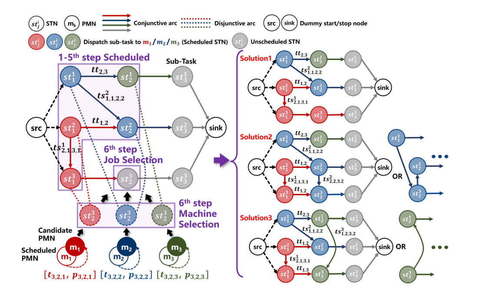

# Overview
控制流和数据流与调度的联系？

## MT-FJSP

DG-FJSP是一个有向无环图$ G=(O,C,D)$，图的不同路径可能代表调度解的各种可能性。
- $O$是子任务节点，
- $C$是有向边，表示同一任务下不同子任务操作顺序
- $D$是无向边，表示同一机器上不同子任务进行顺序

## MDP
调度决策建模为MDP
$$
<S_t,A_t,R_t>
$$

- $S_t$已调度的机器节点的功率等信息特征和任务节点index、所需时间等特征
- $A_t$ 从下一时间步可能进行的子任务节点中选择一个，从所有机器节点选择一个，分配子任务节点
- $R_t$ [最大完成时间，总能量消耗，...]